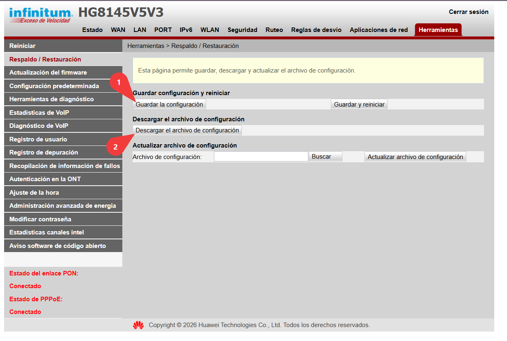

  

  <strong>Recupera tus credenciales PPPoE desde el respaldo de configuración de tu ONT Huawei, completamente en local.</strong>

Telmex'nt existe para no tener que depender del **fucking TELMEX**, que se pasa por los huevos la entrega de la contraseña PPPoE de un servicio que **UNO paga**. Si las credenciales están en el respaldo de tu propio equipo, la herramienta intenta recuperarlas para que puedas configurar tu conexión en el router o equipo que tú quieras.

Actualmente está hecha con el **Huawei HG8145V5V3** en mente y busca cuentas PPPoE de TELMEX (`@prodigyweb.com.mx`). Puede funcionar con otros equipos Huawei distribuidos por TELMEX si utilizan el mismo formato de respaldo y cifrado.

## Qué hace

- Abre y descifra respaldos de configuración Huawei compatibles.
- Localiza las credenciales PPPoE de TELMEX dentro del XML.
- Descifra la contraseña almacenada por el equipo.
- Permite copiar las credenciales o descargarlas como TXT.
- Todo el procesamiento se realiza **localmente en tu navegador**.
- No requiere Bun, Node.js, npm, backend, instalación ni proceso de build.
- No carga Tailwind, CryptoJS, Lucide ni ninguna otra dependencia desde Internet.

El respaldo, el usuario PPPoE y la contraseña **no se envían a ningún servidor** ni se guardan en disco por la aplicación.

## Cómo obtener el archivo de respaldo

También puedes abrir esta guía directamente desde el botón **¿Cómo obtengo el respaldo?** dentro de Telmex'nt.

En el panel de administración del Huawei HG8145V5V3:

1. Abre el panel de administración del módem. Por lo general está en [**192.168.1.254**](http://192.168.1.254/).
2. Entra a **Herramientas → Respaldo / Restauración**.
3. Pulsa **Guardar la configuración**.
4. Pulsa **Descargar el archivo de configuración** y guarda el archivo generado.
5. Usa ese archivo en Telmex'nt.

  

> La interfaz puede cambiar dependiendo del firmware o del modelo de ONT. Telmex'nt no modifica la configuración del equipo: únicamente lee el archivo de respaldo que tú le proporcionas.

## Uso

No hay nada que instalar.

1. Descarga o clona el proyecto.
2. Abre `index.html` en un navegador moderno.
3. Selecciona o arrastra el respaldo descargado desde tu ONT.
4. Telmex'nt intentará localizar y descifrar las credenciales PPPoE.

También puedes publicar estos archivos directamente en cualquier hosting estático.

## Alcance

Telmex'nt está pensado para recuperar credenciales de **tu propio servicio y tu propio respaldo de configuración**. No está diseñado para obtener credenciales de terceros ni para acceder a equipos sobre los que no tengas autorización.
